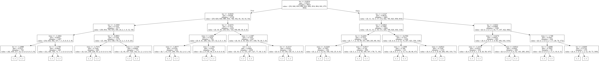
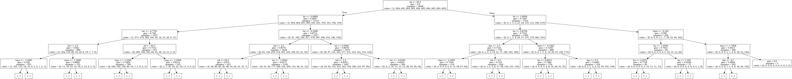
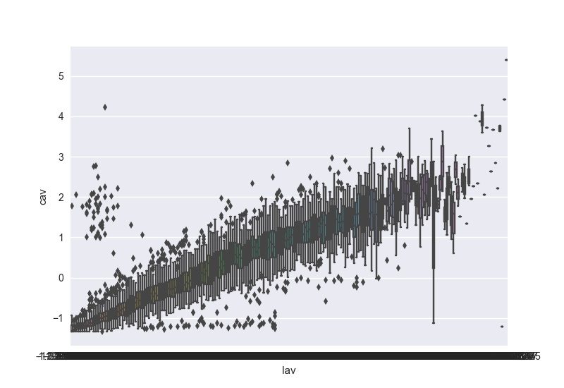
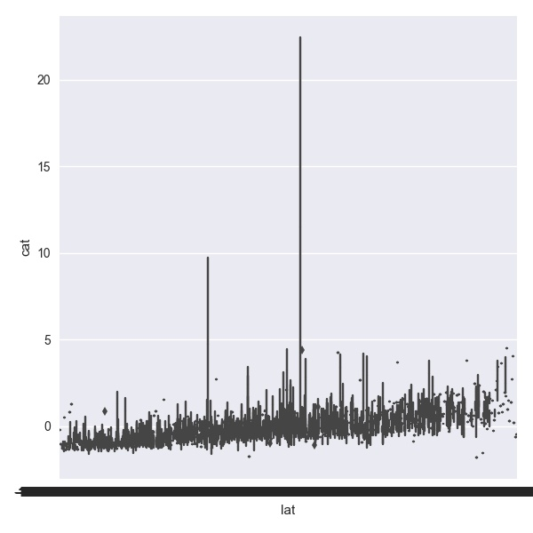
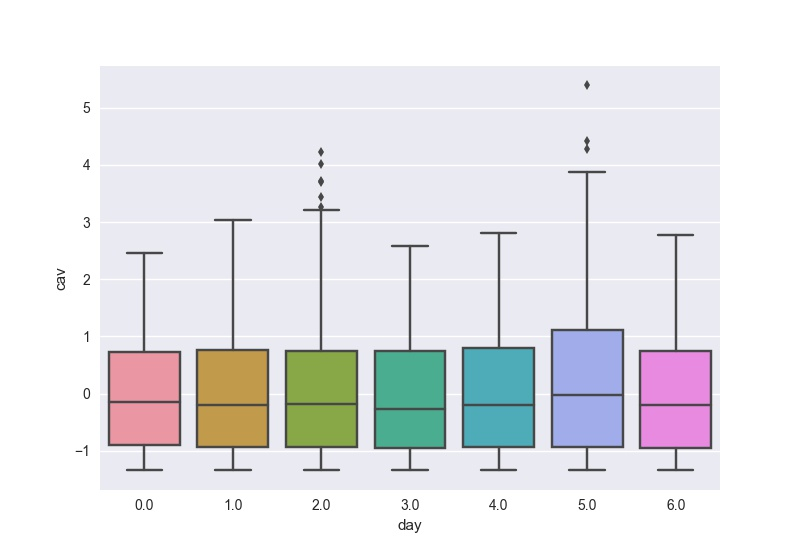
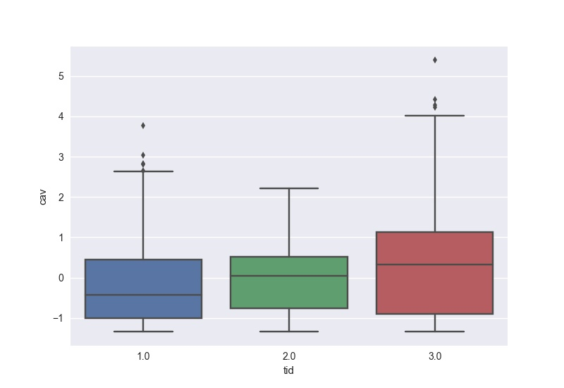
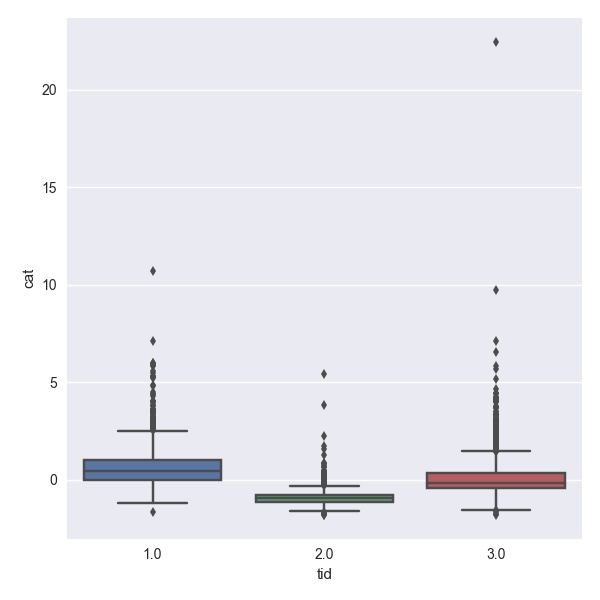

# KDD CUP2017

the answer of universe

李则言 陈光斌 陈禹东

---

## 最终成绩

### Travel Time Prediction

未在线评测

### Volume Prediction

MAPE： 	0.1760

Rank：	55

## 最初的尝试——直接拟合曲线

最开始的时候希望直接拟合travel time和volume曲线之前若干点到某一点的映射。即对于一个连续的时间序列$\vec{a}$，我们希望得到一个$<\vec{a}_{i-k},\vec{a}_{i-k+1},......\vec{a}_{i-1}>\to<\vec{a}_i>$的映射。

也就是说对于travel time和volume两个问题，分别训练这样的映射：

$$
<\text{tollgate}, \text{intersection}, \text{previous average travel time}, \\ \text{previous average volume}, \text{daily time}, \text{day of week}, \text{weather features}> \\
\to <\text{average travel time}>
$$

$$
<\text{tollgate}, \text{direction}, \text{previous average volume}, \text{daily time}, \text{day of week}, \text{weather features}> \\ 
\to <\text{average volume}>
$$

在travel time prediction中，我们认为之前时间段的average volume也是有影响的。同时每天的不同时间（daily time），星期几（day of week）以及天气数据（weather features）都是有影响的。为此需要按照顺序提取天气，流量和通过时间的数据：

``` python
weather_data = extract_weather(FLAGS.weather_input, FLAGS.weather_raw_data)
weather_data = weather_data[weather_data[:, 0].argsort()]
volume_data = extract_volume_naive(FLAGS.volume_input, FLAGS.volume_raw_data, weather_data)
volume_data = volume_data[volume_data[:, -1].argsort()]
travel_time_data = extract_travel_time_naive(FLAGS.travel_time_input, FLAGS.travel_time_raw_data, volume_data)    
```

为了平滑数据以及便于使用一些分类模型来处理问题，我们将average travel time和average volume按照等深或者等宽的方法分成若干个桶，然后将训练数据和测试数据都转化为桶标签（而不是连续的值）。模型给出的结果也是桶标签，我们再将这个桶的平均值作为预测的结果。

在本地，我们使用k-fold cross validation的方法来进行测试。经过测试，发现使用Decision Tree， Random Forest， SVC， MLP等模型得到的分类的准确率（Accuracy）最高的连一半都不到。于是我们判断直接拟合曲线这种策略不太可行。

## 简单的数据分析

首先我们使用将之前直接拟合曲线训练出的决策树绘制出来，以判断哪些feature的影响是重要的。(图片太小可以查看`report/`下的原图片) 





可以看到，起到至关重要作用的只有previous average travel time(lat)和previous average volume(lav)，其次是tollgate id和intersection id和daily time，而剩下的其他因素影响就十分微弱了。这样的关系倒是也符合直观的认知，但是太简单，不能准确地预测目标。

还可以直接绘制分布图来看它们之间的关联：

- *previous average volume* $\to$ *current average volume*

  

  可以看出相关性是非常明显的，但是数据点的异常值特别多，所以必须要 进行一些处理，至少也应该使用一些更加鲁棒的模型。

- *last travel time* $\to$ *average travel time*

  

  相关性也很明显，同样，有很多明显的异常值和异常分布。

- *day of week* $\to$ *average travel time* or *average volume*

  

  

  星期几对数据的影响不大

- *tollgate* $\to$ *average travel time or average volume*

  

  

  不同收费站之间的差别是比较大的，因此不同收费站分别训练模型可能会比将收费站id作为一个参数会更好.


## Volumn部分

1、one-hot编码

一开始的星期几表示我们使用数字表示（比如星期一对应0,星期二对应1），但在经过思考以及采取其他同学意见后，我们决定采用one-hot编码（比如星期一对应1000000，星期二对应0100000）。


2、数据清洗

在KDD CUP进行到第二轮时，由于发现用于测试的那几天不包含国庆节，故我们将训练数据中10月1号到10月7号的数据全部删除，因为这几天的收费站流量明显高于其他天数，将这些特殊数据删掉更有利于最终的预测。在进行了数据清洗之后，本地测试的MAPE从0.18~0.19下降到0.16~0.17，效果大大提升。


